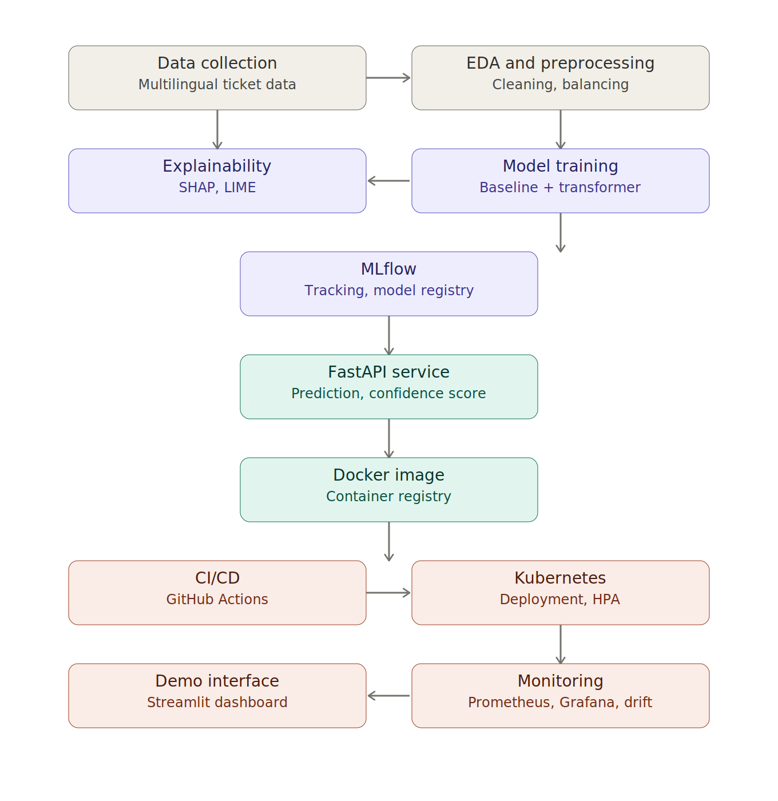

# Support Ticket Classification and Priority Prediction — Full-Scope MLOps Project Guide

**Project owner:** Mustafa Arıkan
**Goal:** Internship project (top grade) + a production-grade NLP/MLOps system that stands out on a CV

---

## 1. Overall Architecture



---

## 2. Project Summary

Automatically process incoming support requests (email, form, chat text) to:
1. **Classify category** (e.g. Technical Issue, Billing, Refund, Account, General Inquiry)
2. **Predict priority** (Low / Medium / High / Critical)
3. **Explain the decision** (SHAP/LIME)

then turn this into a service that is automatically deployed via CI/CD on Docker + Kubernetes, with full observability.

**Narrative (use this in interviews/presentations):**
> "Support teams manually triage and prioritize incoming tickets. I automated this process with NLP, made the model's decisions explainable, and built a production system that auto-scales on Kubernetes with continuous performance monitoring."

---

## 3. Goals and Success Criteria

| Dimension | Target |
|---|---|
| Model performance | Macro F1 ≥ 0.85 for category classification, ≥ 0.75 for priority prediction |
| Explainability | Top 5 most influential words/features shown for every prediction (SHAP/LIME) |
| Service | FastAPI with <200ms p95 response time |
| Container | Docker image <1GB, multi-stage build |
| Orchestration | Min 2 replicas on K8s, auto-scaling via HPA |
| CI/CD | Automatic test + build + deploy on every push |
| Monitoring | Live metrics via Prometheus/Grafana + a simple drift alert |
| Academic | Report covering every rubric item (problem definition, literature, data, method, results, discussion) |

---

## 4. Technology Stack

```
Language & ML:     Python 3.11, scikit-learn, PyTorch, HuggingFace Transformers
NLP:               BERTurk / DistilBERT (multilingual), spaCy, NLTK
Explainability:    SHAP, LIME
Tracking:          MLflow (experiment tracking + model registry)
API:               FastAPI, Pydantic, Uvicorn
Demo:              Streamlit
Container:         Docker, Docker Compose
Orchestration:     Kubernetes (Minikube/Kind locally, GKE/AKS optional in cloud)
CI/CD:             GitHub Actions
Monitoring:        Prometheus, Grafana
Database:          PostgreSQL (optional, for prediction history)
Testing:           pytest, locust (load testing)
```

---

## 5. Folder Structure

```
support-ticket-classifier/
├── data/
│   ├── raw/                  # Raw data
│   ├── processed/            # Cleaned data
│   └── data_validation.py    # Data schema validation
├── notebooks/
│   ├── 01_eda.ipynb
│   ├── 02_baseline_models.ipynb
│   └── 03_transformer_finetune.ipynb
├── src/
│   ├── data/
│   │   ├── preprocessing.py
│   │   └── feature_engineering.py
│   ├── models/
│   │   ├── train.py
│   │   ├── evaluate.py
│   │   └── explain.py        # SHAP/LIME
│   ├── api/
│   │   ├── main.py           # FastAPI app
│   │   ├── schemas.py        # Pydantic models
│   │   └── predictor.py
│   └── monitoring/
│       └── drift_check.py
├── tests/
│   ├── test_api.py
│   ├── test_preprocessing.py
│   └── test_model.py
├── docker/
│   ├── Dockerfile
│   └── docker-compose.yml
├── k8s/
│   ├── deployment.yaml
│   ├── service.yaml
│   ├── hpa.yaml
│   └── configmap.yaml
├── .github/
│   └── workflows/
│       └── ci-cd.yaml
├── streamlit_app/
│   └── app.py
├── mlruns/                    # MLflow local tracking (add to gitignore)
├── requirements.txt
├── README.md
└── report/                    # Internship report sources
```

---

## 6. Phase-by-Phase Roadmap

### Phase 0 — Setup and Environment
**Duration:** 2-3 days

- [x] Create the GitHub repo, set up the folder structure
- [x] Set up a Python virtual environment / conda env
- [x] Install Docker Desktop, confirm it works (`docker run hello-world`)
- [x] Install Minikube or Kind (local K8s cluster)
- [x] Run MLflow locally, access the UI (`mlflow ui`)
- [x] Draft `requirements.txt`
- [x] Write a README.md skeleton (project goal, setup instructions)

**Output:** A working dev environment, an empty but structured repo.

---

### Phase 1 — Problem Definition and Data Collection
**Duration:** 3-5 days

- [x] Literature review: similar support ticket classification work (2-3 papers/blog posts)
- [x] Pick a data source:
  - Ready-made "customer support ticket" datasets on Kaggle (English)
  - For Turkish: synthetic data generation (LLM-generated ticket samples) blended with real examples
  - Multilingual approach: combine an English dataset with Turkish synthetic data
- [x] Finalize the label schema:
  - Category: Technical Issue, Billing, Refund, Account Management, General Inquiry (5 classes recommended — more adds unnecessary complexity)
  - Priority: Low, Medium, High, Critical (4 levels)
- [x] Write a data schema document (column names, types, expected value ranges)
- [x] Add basic schema validation in `data_validation.py` (e.g. pandera or great_expectations)

**Output:** `data/raw/tickets.csv`, a data dictionary document.

**Note:** The most common mistake here is moving on without checking data quality. Always check the class distribution (is it imbalanced?).

---

### Phase 2 — EDA and Data Preprocessing
**Duration:** 4-6 days

- [x] `01_eda.ipynb`: class distribution, text length distribution, missing values, language distribution
- [ ] Text cleaning pipeline: lowercasing, punctuation, stop-words (separate lists for Turkish and English), lemmatization
- [ ] Class imbalance analysis → choose a strategy:
  - Class weighting (simple, recommended starting point)
  - SMOTE / oversampling (use carefully for text, try it on embeddings)
  - Focal loss (during transformer fine-tuning)
- [ ] Train/validation/test split (stratified, e.g. 70/15/15)
- [ ] Check for data leakage: tickets from the same customer should not be spread across different splits

**Output:** Clean, split datasets under `data/processed/`, plus an EDA report with visualizations.

---

### Phase 3 — Baseline Modeling
**Duration:** 4-5 days

- [ ] Build a baseline with TF-IDF + Logistic Regression / SVM (fast, interpretable)
- [ ] Compare against Naive Bayes
- [ ] Apply class weighting, compare results
- [ ] Log every experiment to MLflow (parameters, metrics, confusion matrix artifact)
- [ ] Note baseline metrics — these answer the "why a transformer, wouldn't a simple model suffice?" question later

**Output:** 3-4 baseline experiments logged in MLflow, a comparison table.

**Why it matters:** When a reviewer/professor asks "why use a transformer, wouldn't a simple model do?", you'll have numerical evidence ready.

---

### Phase 4 — Advanced Modeling (Transformer Fine-Tuning)
**Duration:** 7-10 days

- [ ] Choose BERTurk (`dbmdz/bert-base-turkish-cased`) or a multilingual model (`xlm-roberta-base`)
- [ ] Build a fine-tuning pipeline with the HuggingFace `Trainer` API
- [ ] Consider multi-task learning: a shared backbone with two output heads for category + priority (optional, advanced showcase)
- [ ] Hyperparameter tuning (learning rate, batch size, epoch count) — log every run to MLflow
- [ ] Add early stopping and learning rate scheduling
- [ ] Register the best model in the MLflow Model Registry, tag it "staging"

**Output:** A fine-tuned model, versioned in MLflow, with proven improvement over the baseline.

---

### Phase 5 — Explainability
**Duration:** 3-4 days

- [ ] Use SHAP to extract word-level importance scores for transformer outputs
- [ ] Use LIME to produce an alternative/comparative explanation
- [ ] Build a "top 5 influential words" visualization for each prediction
- [ ] Define the JSON schema for embedding explanations into the API response

**Output:** `src/models/explain.py`, sample explanation visuals.

**CV impact:** This step sets you apart from students who "just train a model." It shows awareness of responsible AI / model transparency.

---

### Phase 6 — Model Tracking and Registry (MLflow Consolidation)
**Duration:** 2-3 days (can run in parallel with Phases 3-4)

- [ ] Verify every experiment is properly logged in MLflow
- [ ] Define promotion criteria for the registry's "production" stage (e.g. F1 > 0.85)
- [ ] Document the model versioning strategy

**Output:** A clean, traceable experiment history — directly usable charts for the report.

---

### Phase 7 — API Development (FastAPI)
**Duration:** 4-5 days

- [ ] Define request/response schemas with Pydantic (`schemas.py`)
- [ ] `/predict` endpoint: take text → return category + priority + confidence score + explanation
- [ ] `/health` endpoint (for K8s liveness/readiness probes)
- [ ] `/metrics` endpoint (Prometheus format)
- [ ] Load the model from the MLflow registry in code (not a hardcoded path)
- [ ] Handle errors: empty text, overly long text, unsupported language scenarios
- [ ] Write API tests with `pytest` (at least 8-10 test cases)

**Output:** A locally working, tested FastAPI service.

---

### Phase 8 — Containerization (Docker)
**Duration:** 2-3 days

- [ ] Write a multi-stage Dockerfile (build stage + slim runtime stage)
- [ ] Add a `.dockerignore` (keep unnecessary files out of the image)
- [ ] Optimize image size (slim Python base image, prune unnecessary dependencies)
- [ ] Use `docker-compose.yml` to bring up the API + MLflow + Prometheus together
- [ ] Test locally in Docker: `docker build`, `docker run`, curl the endpoints

**Output:** A working, optimized Docker image.

---

### Phase 9 — CI/CD (GitHub Actions)
**Duration:** 3-4 days

- [ ] Create `.github/workflows/ci-cd.yaml`:
  - On push/PR: run linting (flake8/black) → run pytest → test the Docker build
  - On merge to main: push the Docker image to a registry (Docker Hub or GitHub Container Registry)
  - (Optional, advanced) Automatically update/apply the K8s manifests
- [ ] Manage secrets (Docker Hub credentials) via GitHub Secrets
- [ ] Add a build status badge to the README

**Output:** A pipeline that runs automatically on every commit, build status visible in the README.

---

### Phase 10 — Kubernetes Deployment
**Duration:** 5-7 days

- [ ] `deployment.yaml`: replica count, resource limits/requests, liveness/readiness probes
- [ ] `service.yaml`: ClusterIP or LoadBalancer
- [ ] `configmap.yaml`: environment variables (model version, log level)
- [ ] `hpa.yaml`: CPU/memory-based auto-scaling (min 2, max 5 replicas)
- [ ] Deploy on Minikube/Kind, verify with `kubectl get pods`, `kubectl logs`
- [ ] Run a load test (locust) to demonstrate the HPA triggering — a strong moment for a demo

**Output:** A service running and auto-scaling on K8s, plus screenshots/video.

---

### Phase 11 — Monitoring and Drift Detection
**Duration:** 4-5 days

- [ ] Use Prometheus to collect metrics from the API (request count, latency, error rate)
- [ ] Build a Grafana dashboard: live request volume, latency, model confidence score distribution
- [ ] Add basic data drift detection: compare the feature distribution of incoming data (e.g. word frequencies, text length) against the training data (Kolmogorov-Smirnov test or a simple statistical comparison)
- [ ] Log/alert when the drift threshold is exceeded (email integration optional)

**Output:** Grafana dashboard screenshots, a drift detection report.

**CV impact:** This is the strongest differentiator from the 95% of students who only train models — it's a topic that comes up directly in MLOps interviews.

---

### Phase 12 — Demo Interface (Streamlit)
**Duration:** 2-3 days

- [ ] Text input box, prediction result (category + priority + confidence score), SHAP explanation visual
- [ ] Ability to pick from sample tickets (for a quick demo)
- [ ] Simple, clean design — critical for the "live demo" moment in your presentation

**Output:** A one-click runnable demo interface.

---

### Phase 13 — Report and Presentation
**Duration:** 5-7 days

- [ ] Report structure (adapt to your internship/academic rubric):
  1. Introduction and problem definition
  2. Literature / related work
  3. Dataset and preprocessing
  4. Method (baseline → transformer → explainability)
  5. System architecture (Docker/K8s/CI-CD/monitoring)
  6. Experimental results (tables, charts, confusion matrix)
  7. Discussion (limitations, future work)
  8. Conclusion
- [ ] Include architecture diagrams in the report (like the one above)
- [ ] Presentation slides: live demo + architecture visual + key metrics
- [ ] Polish the GitHub README to portfolio quality (badges, architecture visual, setup steps, demo GIF)

**Output:** Full report, presentation, professional README.

---

## 7. Rubric Alignment Checklist

- [ ] Is the problem clearly defined?
- [ ] Are data quality and preprocessing steps shown?
- [ ] Are multiple models compared (baseline vs advanced model)?
- [ ] Are the right metrics chosen and interpreted (not just accuracy, but F1/precision/recall)?
- [ ] Is the system architecture (deployment) shown?
- [ ] Are results visualized (charts, tables, confusion matrix)?
- [ ] Are limitations and future work discussed honestly?

---

## 8. Risks and Pitfalls

| Risk | Mitigation |
|---|---|
| Data collection takes too long | Cap Phase 1 at 5 days max, start fast with synthetic data |
| Learning K8s takes time | Practice locally with Minikube, don't treat cloud migration as mandatory |
| Transformer fine-tuning needs a GPU | Use Google Colab (free T4 GPU) or Kaggle Notebooks |
| Project scope grows too large, never finishes | Build a "minimum working version" for each phase first, then improve |
| Explainability gets skipped | Schedule Phase 5 in the same week as Phase 4, don't let it slip |

---

## 9. Suggested Timeline (Flexible, Adapt to Internship Duration)

```
Week 1:      Phase 0 + Phase 1
Week 2:      Phase 2
Week 3:      Phase 3
Week 4-5:    Phase 4
Week 6:      Phase 5 + Phase 6
Week 7:      Phase 7
Week 8:      Phase 8 + Phase 9
Week 9-10:   Phase 10
Week 11:     Phase 11
Week 12:     Phase 12
Week 13-14:  Phase 13
```

This table can be compressed or extended based on your actual internship length — share the duration and I can replan it by week.

---

## 10. Quick Start Commands

```bash
# Environment setup
python -m venv venv
source venv/bin/activate  # Windows: venv\Scripts\activate
pip install fastapi uvicorn scikit-learn transformers torch mlflow shap lime streamlit pytest

# Start MLflow UI
mlflow ui --port 5000

# Docker build
docker build -t support-ticket-classifier:latest -f docker/Dockerfile .

# Start Minikube
minikube start
kubectl apply -f k8s/
kubectl get pods
```

---

*This guide is a starting skeleton — come back to it as you progress through each phase for further detail, and for code/architecture support wherever you get stuck.*
